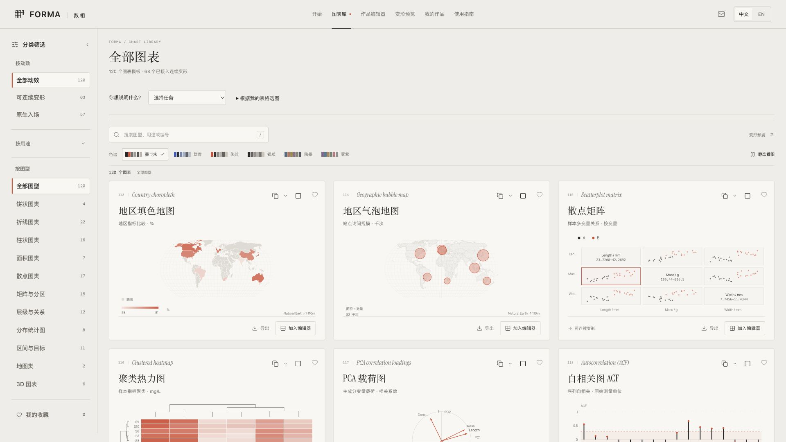

# FORMA · 数相

**让数据从一张图，流动成一个故事。**

FORMA 是一个中英双语的浏览器数据可视化工作台：204 种图表、连续变形动画、可编辑时间轴，以及面向汇报和分享的多种导出方式。无需登录，导入、编辑和导出在本机浏览器内完成。

[在线体验](https://forma.ovocode.xyz) · [定制服务](#定制服务) · [本地运行](#本地运行) · [AGPL-3.0](LICENSE)



## 看看效果

- [高级图表连续变形 · 8 秒](docs/assets/hierarchy-morph.mp4)：层级数据在不同图形结构之间连续转换。
- [三维曲面连续变形 · 7 秒](docs/assets/spatial-morph.mp4)：曲面、空间点与平面投影保持对象对应。
- [打开在线图表库](https://forma.ovocode.xyz/#library)，选择图表后可直接交互。

视频和截图来自 FORMA 的实际演示。在线站点与仓库的更新可能存在时间差。

## 可以做什么

- **选图与制图**：图库和编辑器优先展示柱状、条形、折线、饼图、环形等常用图表，再展开专业图型；每种图表配有数据字段说明和示例。
- **连续变形**：100 种模板可进入兼容的连续变形系列，在层级、序列、统计和空间等场景中追踪同一对象；不兼容时采用目标图自身的入场动画。
- **导入自己的数据**：支持 Excel、CSV 和 Excel/WPS 区域粘贴，编辑字段对应、单位、颜色、标注和动画节奏。
- **编辑完整作品**：多步骤编排、时间轴、品牌样式、撤销和浏览器本地保存；可下载项目文件备份。
- **交给 Agent**：复制含数据契约、样式和动效规则的制作说明，配合互动 HTML 或 Agent 工具继续制作。网站不会自动把数据发送给外部 AI。

## 200+ 图表，新增三批高级模板

图库现有 **204 种（200+）**，本次增加 36 种，全部提供可编辑示例、数据字段说明、中英双语帮助和原生入场动画。

| 批次 | 新增图型 |
| --- | --- |
| 统计与回归诊断 | 嵌套分位箱图、密度抖动散点、悬挂根图、经验分布置信带、双样本 Q–Q、去趋势 Q–Q、离散度水平、尺度位置、残差杠杆、Cook 距离、偏回归、成分残差 |
| 业务、关系与决策 | 双部网络、自我中心网络、径向热力、螺旋热力、变宽柱图、分解瀑布、层级树表、累积风险、KS 诊断、提升曲线、阈值指标、期望代价 |
| 工程与信号分析 | 波特幅相、奈奎斯特、尼科尔斯、零极点、史密斯阻抗、风向频率玫瑰、极坐标散点、风矢量廓线、相量、眼图、星座图、转速频率 |

全部模板支持自身的入场动画，跨图连续变形以编辑器给出的兼容性判断为准；预测区间、情景结果等需要提供已有分析结果，工具不会代替分析模型生成结论。

连续变形已覆盖 100 种图库模板，共 138 个可选视图；可在「变形预览」使用以下系列。当前新增 11 套场景：

- **目标与经营指标**：进度条、径向目标、子弹图、仪表、指标卡及前后对照；柱线、双折线与差异面积保留缺失断点。
- **矩阵与真实层级**：矩阵气泡 ↔ 径向热图；一致性 ↔ 关联残差 ↔ 马赛克；嵌套圆 ↔ 径向树 ↔ 汇总表。
- **分布与持续时间**：Q–Q、P–P、Weibull、平均超额、TTT、Lorenz、ECDF 置信带，以及 Kaplan–Meier ↔ Nelson–Aalen。
- **模型评估扩展**：KS 得分类别累积分布接入 ROC、PR、阈值、累计增益与提升系列，完整处理并列分数。

此前已加入的系列：

- **原始点、长尾与半眼**：Sina 原始点 → 嵌套分位箱 → 半眼密度与区间。
- **从样本到概率点阵**：同一组原始点在以上三图和等概率分位点阵之间转换，原始观测与派生摘要分别保留。
- **模型筛选效果**：ROC → PR → 累计增益 → 提升曲线，同一批阈值点保持对应。
- **频率响应三视图**：波特幅相 → 奈奎斯特复平面 → 尼科尔斯增益相位，相同采样点和相邻连线连续移动。

各系列支持倒放、跳步、编辑、互动 HTML 与同引擎逐帧导出。分位点阵限定单个群体；频响系列需要非零复响应与相同正频率采样网格。数据不满足要求时保留原值并回退原生入场。

## 导出与交付

| 格式 | 用途 |
| --- | --- |
| PNG / SVG | 报告配图、Word 插图、设计排版 |
| MP4 | 动画演示、汇报视频；依赖浏览器编码能力 |
| PPTX | 静态图表或嵌入动画视频的演示文档 |
| 互动 HTML | 包含播放器的离线互动作品 |
| FORMA 项目 JSON | 保留数据、样式和步骤，重新导入后继续编辑 |

动画 PPTX 使用嵌入视频，不等同于 PowerPoint 原生可编辑图表或原生变形切换。Word 和 Excel 成品整理属于下面的定制服务，网站不承诺一键生成完整 Word 报告或 Excel 工作簿。各类导出的许可边界见 [授权说明](LICENSING.md)。

## 定制服务

**有 Excel 数据，但没时间把图表做得好看？可以找我定制。**

提供高级图表设计、连续变形动画、PPT 汇报配图与演示、Word 报告图表、Excel 数据整理，以及网站可视化集成。可按需求交付 PPTX、DOCX、XLSX、PNG/SVG、MP4、互动 HTML 和 FORMA 可编辑项目文件；具体格式、修改范围、交期和费用在制作前确认。

**[邮件咨询定制：yongqixue99@gmail.com](mailto:yongqixue99@gmail.com?subject=FORMA%20定制咨询)**。请说明使用场景、图表数量、期望效果、交付格式与截止日期，数据样例请先脱敏。软件按开源协议免费使用，定制制作与支持服务另行报价。

## 本地运行

推荐 Node.js 22.12+（Node 22 LTS）和 npm。依赖版本由 `package-lock.json` 锁定。

```bash
git clone https://github.com/yongqixue99-hue/forma.git
cd forma
npm ci
npm run build
npm run dev
```

首次启动前需构建一次，生成独立播放器、Agent 工具、图表说明及案例。随后按终端显示的地址打开网站。

```bash
npm run test:forma   # 在构建后运行测试
npm run preview     # 预览 dist/ 中的生产构建
```

应用的核心编辑和导出功能不依赖后端 API。作品保存在当前浏览器的 IndexedDB 中，重要作品请下载项目文件；清理浏览器数据或更换域名不会自动迁移作品。

## 部署与开发

`npm run build` 生成静态站点 `dist/`，可部署到支持静态文件的服务。生产部署说明和可选反馈邮件服务见 [部署文档](docs/DEPLOYMENT.md)。

- `src/forma/`：图表、数据模型、变形引擎、编辑器和导出逻辑。
- `public/data/`：内置公开数据样例。
- `qa/forma/`：自动化测试和构建所需的能力校验工具。
- `skills/forma-charts/`：供 Agent 使用的选图与制作工具。
- `docs/forma/licenses/`：第三方许可证副本。

生成的播放器和数百份演示 HTML 可由源码重建，不纳入 Git；网站使用的短视频和 README 示例保留在仓库中。提交改进前请阅读 [贡献指南](CONTRIBUTING.md)。

## 开源协议

Copyright © 2026 yongqixue99-hue and FORMA contributors.

本项目原创代码采用 **GNU Affero General Public License v3.0 only（AGPL-3.0-only）**。允许在遵守协议的前提下使用、修改、分发和商用；分发受协议约束的版本以及提供修改后的网络服务时，须履行对应源码与许可证义务。完整条款以 [LICENSE](LICENSE) 为准，导出内容说明见 [LICENSING.md](LICENSING.md)。

第三方库、字体及数据保留各自授权，不因本仓库开源而改变；详见 [第三方声明](docs/forma/THIRD-PARTY-NOTICES.md)。开源授权不代表维护者对衍生产品背书。
